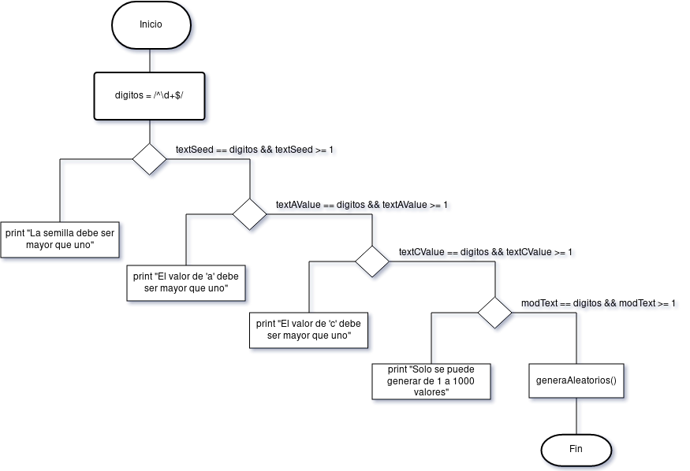
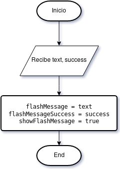
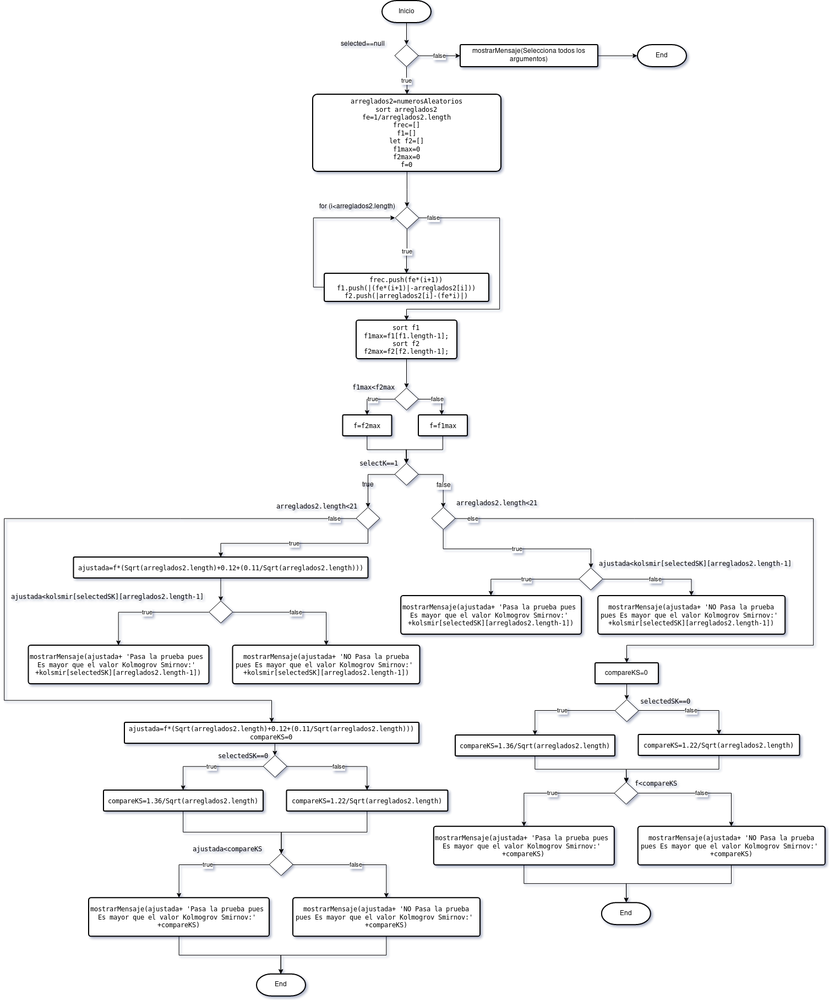
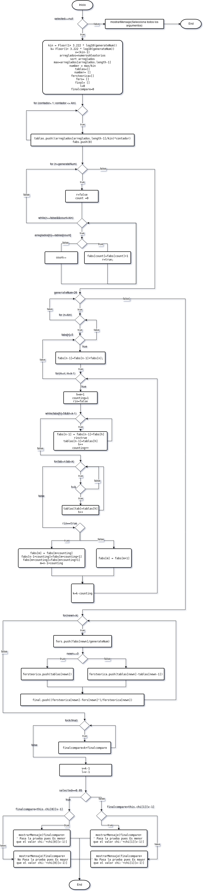
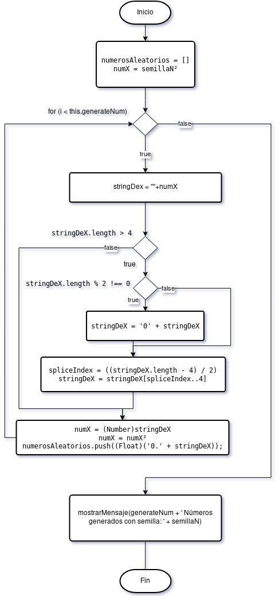
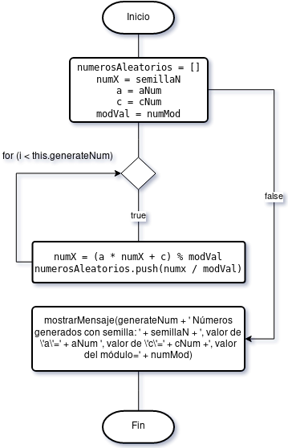
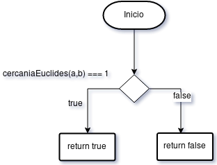
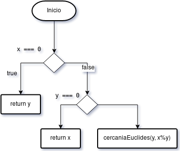
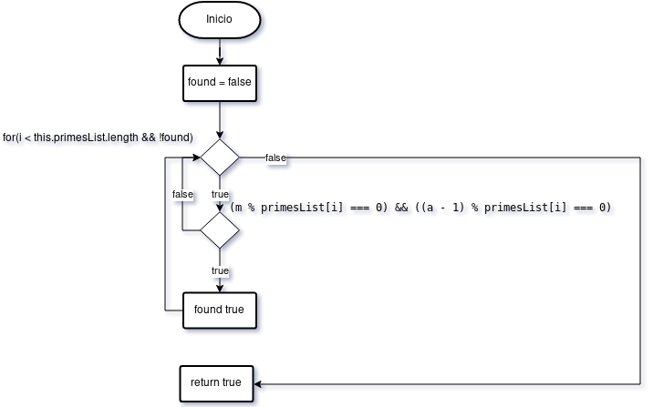
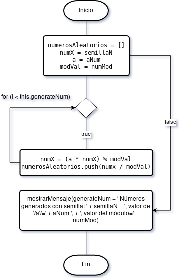

Diagramas de Flujo
==================

Métodos compartidos
*******************

En cada uno de las clases implementadas encontramos cuatro metodos. ``generateA()``, ``mostrarMensaje()`` , ``onGenerateKilmogorov()`` y ``onGenerateChi()``. Por lo que se definiran en esta
sección para evitar duplicar esfuerzos.

``generateA()``:

Este diagrama recibe los parametros iniciales los mapea acorde y checa si algún valor esta vacío.

.. note:: Este diagrama es una variante en cada clase, se ajusta su proceso acorde a las variables que recibe.

``mostrarMensaje()``:

Este método settea las variables para posteriormente mostrar mensajes de alterta o de error en la vista.

.. note:: El valor de ``text`` es el mensaje y ``success`` representa si es un 'error' o 'ok'

``onGenerateKilmogorov()``:

Este diagrama hace las prueba de Kolmogorov para asegurarse que un cantidad ``n`` de números aleatorios hayan seguido una distribucción uniforme.

``onGenerateChi()``:

Este diagrama hace las prueba de Chi Cuadrada para asegurarse que un cantidad ``n`` de números aleatorios hayan seguido una distribucción uniforme.

Métodos Generadores
*******************

Método de Centro Cuadrado
-------------------------

``generaAleatorios()``:

Este diagrama genera números aleatorios con una probabilidad uniforme usando el método cuadrado perfecto.

Método Congruencial Lineal
--------------------------

``generaAleatorios()``:

Este método genera números aleatorios con una probabilidad uniforme usando el método congruencial lineal.

Método Congruencia Mixto
------------------------

``primosCercanos()``:

Este método se apoya de la teorema de euclides para checar si dos numeros son primos relativos. Esto se hace con la finalidad de
comprobar el teorema de HULL-DOBELL

``cercaniaEuclides()``:

Teorema de Euclides puesto en practica.

``checarPrimos()``:

Este método se usa para checar que por lo menos exista un número ``q`` primo de ``m`` que divida a ``a-1``

``generaAleatorios()``:

Este método genera números aleatorios con una probabilidad uniforme usando el método congruencial mixto.

Generador Multiplicativo
------------------------

``generaAleatorios()``:

Este método genera números aleatorios con una probabilidad uniforme usando el método del generador multiplicativo

