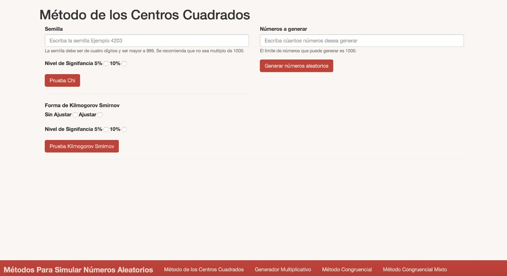
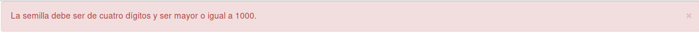
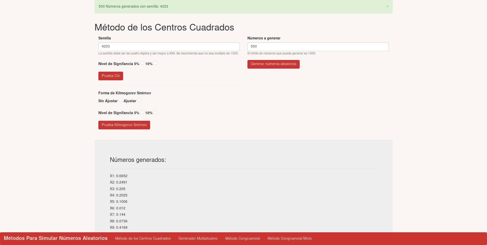
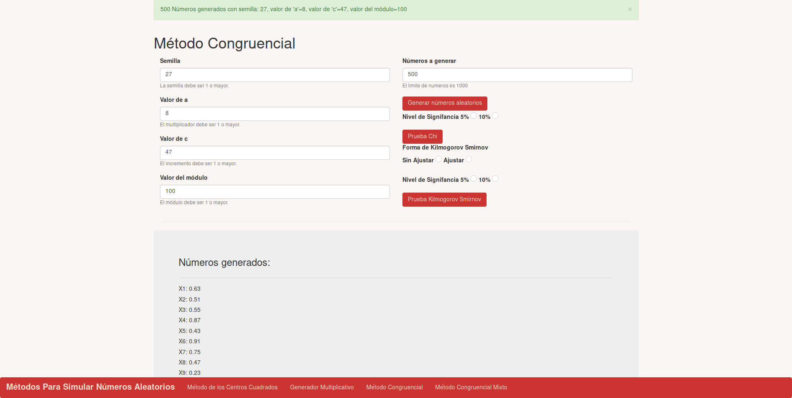
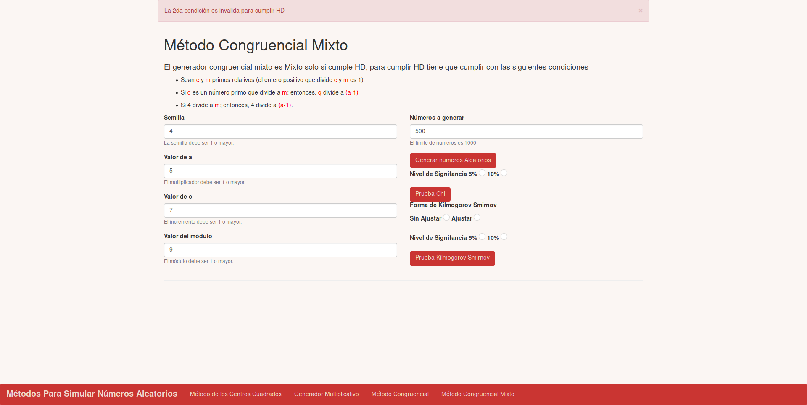
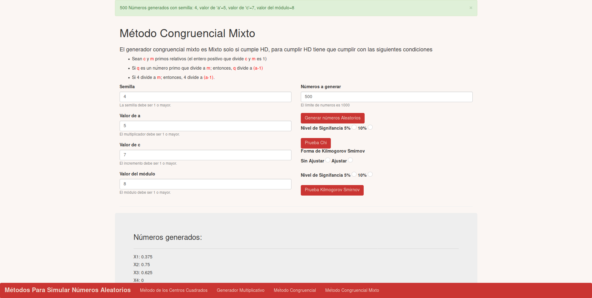
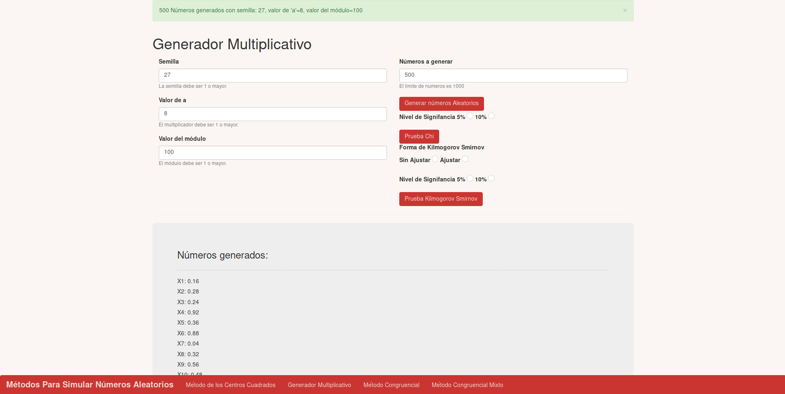
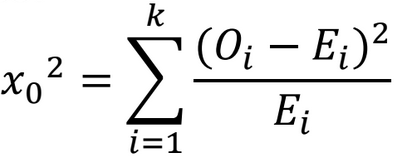
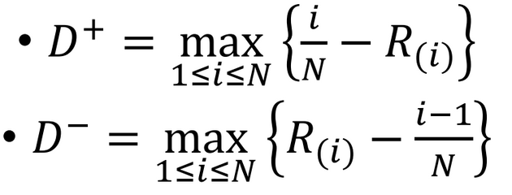

Manual de Usuario
=================

Bienvenido al ``Generador de Números Aleatorios``. Este programa esta hecho por Héctor Flores, Gustavo Mendez y Alfonso Ledezma
a continuación veremos las diferentes formas de interactuar con el sistema.

El sistema se compone de 4 diferentes módulos:

.. contents::

Acceso
******

Se puede accesar al sistema de dos formas:

* Compilando desde código
* Usando el ejecutable

Opcion 1: Compilando desde código:
----------------------------------

.. note:: Para poder ejecutar este paso es necesario contar con ``node`` y ``npm``

1-. Navegamos al repositorio Github: https://github.com/Gustavo2531/GeneradorRandom

2-. Clonamos el repositorio usando::

    git clone https://github.com/Gustavo2531/GeneradorRandom.git

3-. Descargamos las dependencias usando::

    npm install

4-. Construimos el proyecto usando::

    ng build

5-. Ejecutamos el proyecto usando::

    ng serve

6-. Navegamos a la dirección http://localhost:4200 y listo

Opcion 2: Usando el ejecutable:
-------------------------------

.. note:: Esta opción solo es valida si eres usuario Windows

1-. Ejecutamos el ejecutable incluido en el CD con terminación ``.exe``

Opciones
********

Una vez que estes en el navegador veras una pantalla muy similar a esta.

En la parte inferior se puede notar una barra de color roja. Ese es tu menú de navegación y en ella podras
iterar en cada una de las opciones del programa.

Actualmente estas posicionado en el ``Método de Cuadrado Perfecto``

.. attention:: Independientemente de la opción que selecciones es necesario llenar todos los campos de la ventana actual

Generador de Centros Cuadrados
------------------------------

Para empezar a usar el ``Generador de Cuadrado Perfecto`` este requiere usar una semilla aleatoria que el usuario
debera de proporcionar. De igual forma se debe especificar un limite de números en el segundo recuadro.

.. note:: En caso de te llegaras a equivocar en uno de los parametros de control el mismo sistema te avisara con un anuncío similar a este

Una vez que hayas especificado todos los valores puedes hacer click en el bóton **Generar números aleatorios** a continuación aparecera algo así.

En caso de querer las pruebas Chi o Kolmogorov respectivamente se pueden usar los apartados especificados donde:

* En la prueba Chi se pide el nivel de ``significancia``
* En la prueba de Kolmogorov se pide el tipo de ``ajuste`` y ``significancia``

Generador Congruencial Lineal
-----------------------------

Para empezar a usar el ``Generador Congruencial Lineal`` este requiere usar una semilla aleatoria que el usuario
debera de proporcionar. De igual forma se debe especificar un limite de números en el segundo recuadro. Adicionalmente se debera especificar un valor ``a`` , ``c`` y el valor del modulo o ``m`` respectivamente.

.. note:: En caso de te llegaras a equivocar en uno de los parametros de control el mismo sistema te avisara con un anuncío similar a este

Una vez que hayas especificado todos los valores puedes hacer click en el bóton **Generar números aleatorios** a continuación aparecera algo así.

En caso de querer las pruebas Chi o Kolmogorov respectivamente se pueden usar los apartados especificados donde:

* En la prueba Chi se pide el nivel de ``significancia``
* En la prueba de Kolmogorov se pide el tipo de ``ajuste`` y ``significancia``

Generador Congruencial Mixto con pruebas de HULL-DOBELL
-------------------------------------------------------

Para empezar a usar el ``Generador Congruencial Mixto`` este requiere usar una semilla aleatoria que el usuario
debera de proporcionar. De igual forma se debe especificar un limite de números en el segundo recuadro. Adicionalmente se debera especificar un valor ``a`` , ``c`` y el valor del modulo o ``m`` respectivamente.

.. note:: En caso de te llegaras a equivocar en uno de los parametros de control el mismo sistema te avisara con un anuncío similar a este

Una vez que hayas especificado todos los valores puedes hacer click en el bóton **Generar números Aleatorios**.

En este caso en particular pueden existir dos escenarios. En caso de que no se cumplan las pruebas de HULL-DOBELL el programa enseñara
una alerta como se muestra a continuación.

Donde la alerta puede ser uno de los siguientes tres casos

* .. image:: files/usuario/1era.png

* .. image:: files/usuario/2nda.png

* .. image:: files/usuario/3era.png

En caso de que los números si pasen la prueba de HULL-DOBELL se mostrara una imágen a continuación como esta:

En caso de querer las pruebas Chi o Kolmogorov respectivamente se pueden usar los apartados especificados donde:

* En la prueba Chi se pide el nivel de ``significancia``
* En la prueba de Kolmogorov se pide el tipo de ``ajuste`` y ``significancia``

Generador Multiplicativo
------------------------

Para empezar a usar el ``Generador Multiplicativo`` este requiere usar una semilla aleatoria que el usuario
debera de proporcionar. De igual forma se debe especificar un limite de números en el segundo recuadro. Adicionalmente se debera especificar un valor ``a`` y el valor del modulo o ``m`` respectivamente.

.. note:: En caso de te llegaras a equivocar en uno de los parametros de control el mismo sistema te avisara con un anuncío similar a este

Una vez que hayas especificado todos los valores puedes hacer click en el bóton **Generar números Aleatorios**. Debera aparecer una pantalla a continuación como esta:

En caso de querer las pruebas Chi o Kolmogorov respectivamente se pueden usar los apartados especificados donde:

* En la prueba Chi se pide el nivel de ``significancia``
* En la prueba de Kolmogorov se pide el tipo de ``ajuste`` y ``significancia``

Pruebas de Bondad
*****************

Chi Cuadrada
------------

En cada una de las ventanas del sistema esta incluido el apartado para hacer las pruebas de ``Chi Cuadrada``. En orden para activarlas
es necesario primero haber generado los números aleatorios.

La prueba Chi se puede medir con un:

* 5% de significancia
* 10% de significancia

En cualquiera de los casos el valor se manifesta como una ventana en la parte superior del programa informando del resultado
de la siguiente forma:

* .. image:: files/usuario/chi_si.png
* .. image:: files/usuario/chino.png

Donde el primer número que enseña es el valor que se saco del promedio de la formula

El segundo número es valor téorico dado por la tabla.

Kolmogorov-Smirnov
------------------

En cada una de las ventanas del sistema esta incluido el apartado para hacer las pruebas de ``Kolmogorov-Smirnov``. En orden para activarlas
es necesario primero haber generado los números aleatorios.

La prueba Kolmogorov-Smirnov se puede medir con un:

* 5% de significancia

    1-. Ajuste

    2-. Sin Ajuste

* 10% de significancia

    1-. Ajuste

    2-. Sin Ajuste

En cualquiera de los casos el valor se manifesta como una ventana en la parte superior del programa informando del resultado
de la siguiente forma:

* .. image:: files/usuario/si-kol.png
* .. image:: files/usuario/no_kolm.png

Donde el primer número que enseña es el valor que se saco del maximo entre estas dos formulas

El segundo número es valor téorico dado por la tabla.

Referencias
***********

* Cendeja, Leopoldo. “Pruebas De Bondad De Ajuste.” Metodos Cuantitativos y de Simulación. 7 Mar. 2018, CDMX, ITESM CCM.

* UMNG. “Tabla 1. Distribución Chi-Cuadrado x2.” Facultad De Estudios a Distancia, UMNG, virtual.umng.edu.co/distancia/ecosistema/ovas/esp_alt_ger/teoria_de_las_decisiones_gerenciales/unidad_2/medios/documentacion/p7h3.php.

* Zaiontz, Charles. “Kolmogorov-Smirnov Table.” Real Statistics Using Excel , Wordpress, www.real-statistics.com/statistics-tables/kolmogorov-smirnov-table/.